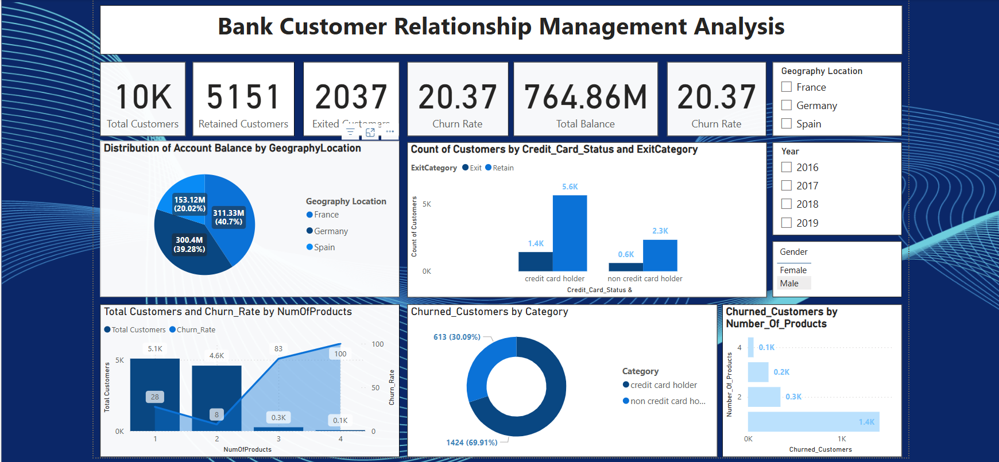

# CRM Bank Analysis

## 📌 Overview
This project focuses on customer data analysis for a bank using CRM data to uncover insights about churn prediction, customer lifetime value, marketing effectiveness, and service improvement. The objective is to support strategic decision-making to boost customer retention and profitability.

## 📊 Data Sources
- *Excel Dataset* – Contains customer demographics, account details, transaction history, and churn information.
- *Analysis Report* – Excel-based calculations and pivot tables addressing key business questions.
- *Presentation (PPTX)* – Summarized trends, predictive insights, and actionable recommendations.

## 🔍 Key Analyses and Insights

### 🛠 Data Cleaning & Processing
- Removed duplicates and handled missing values for accurate insights.
- Converted categorical variables for modeling.
- Ensured consistency in formats (e.g., dates, currency, account status).

### 🎯 Churn Prediction
- Applied segmentation and predictive modeling techniques to forecast customer churn.
- Identified key churn factors: *low account activity, limited product usage, and poor response to marketing*.
- Churn rate found to be higher among *inactive customers with lower tenure*.

### 💡 Customer Lifetime Value (CLV)
- Used historical transaction and retention data to estimate CLV.
- *High CLV customers* tend to use multiple services (loans, credit cards, etc.) and show high digital engagement.
- CLV segmentation helps tailor retention strategies.

### 📈 Marketing Campaign Effectiveness
- Analyzed response rates to previous marketing campaigns.
- Found *personalized marketing* has a significantly higher conversion rate.
- Suggested focus on digital channels and targeted messaging for cost-effective outreach.

### 📅 Customer Tenure Trends
- Longer tenure correlates with higher product adoption and satisfaction.
- *First-year customers* are more likely to churn—highlighting the need for improved onboarding strategies.

### 🧠 Behavioral Segmentation
- Clustered customers based on usage, demographics, and response patterns.
- Segments: *High-Value Retained, At-Risk, Low-Engagement, and New Potential*.
- Targeted strategies can be applied to each segment for better retention and cross-selling.

### 💳 Product Affinity Insights
- Customers using *multiple products* are more loyal and less likely to churn.
- Bundling services (e.g., savings + loan + credit card) can increase stickiness.

## 📌 Recommendations
- ✅ *Strengthen Onboarding Process* – Support new customers during their first year.  
- ✅ *Use Predictive Churn Models* – Identify and act on early warning signs.  
- ✅ *Focus on High CLV Segments* – Allocate more retention resources here.  
- ✅ *Personalize Marketing Efforts* – Leverage behavioral segmentation for better ROI.  
- ✅ *Bundle Banking Products* – Encourage multi-product usage for loyalty.

## 📊 Dashboard & Visualizations

### Dashboard Preview

- *Dynamic filters* for churn status, tenure range, product usage.
- Visualizes *churn trends, CLV segments, campaign success, and customer demographics*.

## 🛠 Tools Used
- *Excel* – Data processing, pivot analysis, and visualization.
- *Pivot Tables & Charts* – Used for dynamic breakdown of customer trends.
- *PowerPoint* – Visual presentation of key business insights.

## 🎯 How to Use This Project
1. *Open the Excel report* – Explore churn metrics, tenure, and campaign data.  
2. *Use dashboard filters* – Gain deeper understanding of each customer segment.  
3. *Apply insights to strategy* – Guide retention, marketing, and service decisions.  

## 🔚 Conclusion
This CRM analysis delivers a *data-driven view of customer behavior*, enabling banks to improve retention, enhance marketing, and grow customer lifetime value. By implementing churn models, segmenting customers, and focusing on high-value individuals, financial institutions can strengthen customer relationships and business outcomes.
